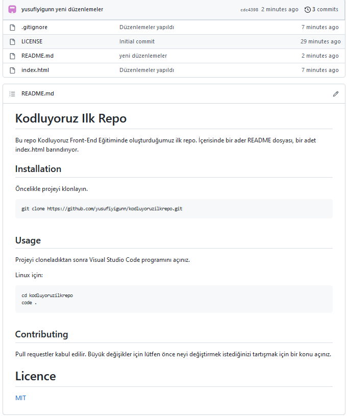

# Kodluyoruz Ilk Repo
Bu repo [Kodluyoruz]([kodluyoruz.org](https://www.kodluyoruz.org/)) Front-End Eğitiminde oluşturduğumuz ilk repo. İçerisinde bir adet README dosyası, bir adet index.html barındırıyor.

## Installation
Öncelikle projeyi klonlayın.

```
git clone https://github.com/yusufiyigunn/kodluyoruzilkrepo.git
```

## Usage 
Projeyi cloneladıktan sonra Visual Studio Code programını açınız.

Linux için:

```
cd kodluyoruzilkrepo
code .
```

## Contributing
Pull requestler kabul edilir. Büyük değişikler için lütfen önce neyi değiştirmek istediğinizi tartışmak için bir konu açınız.

## Licence
[MIT](LICENSE)

## Proje Görseli


